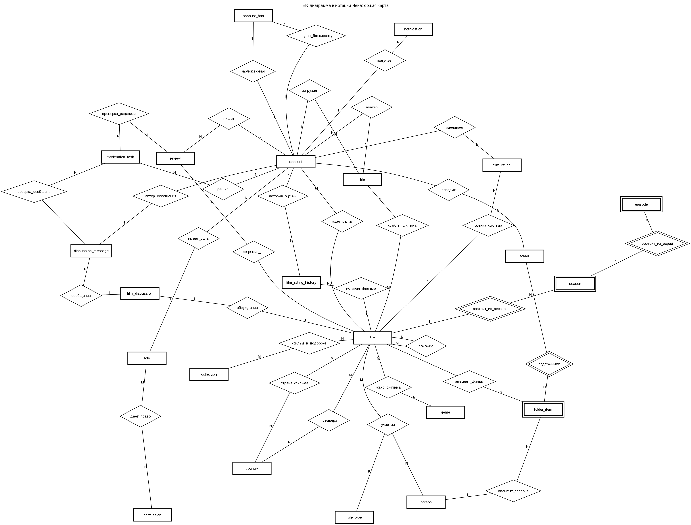
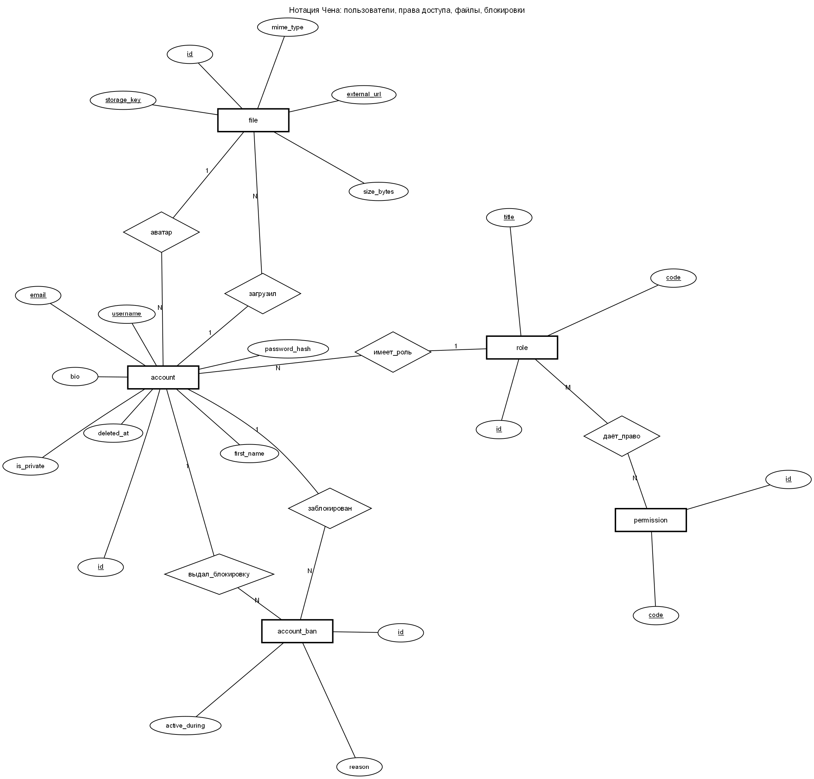
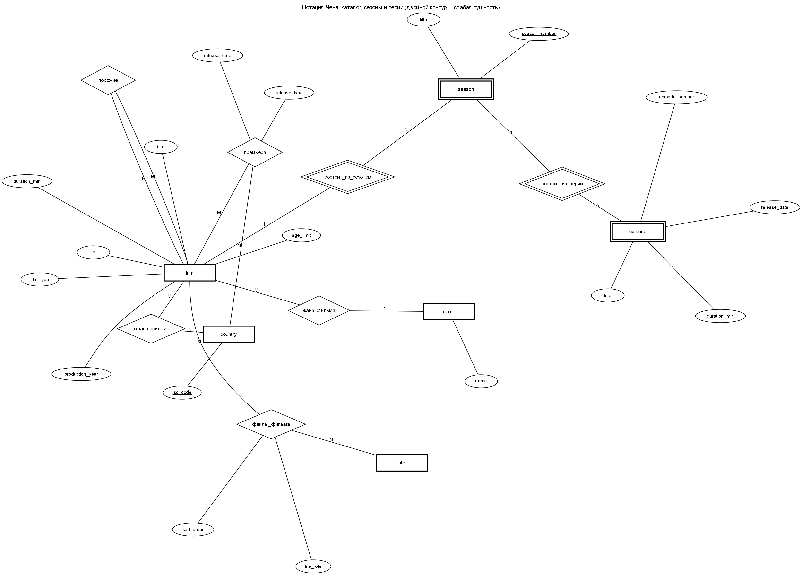
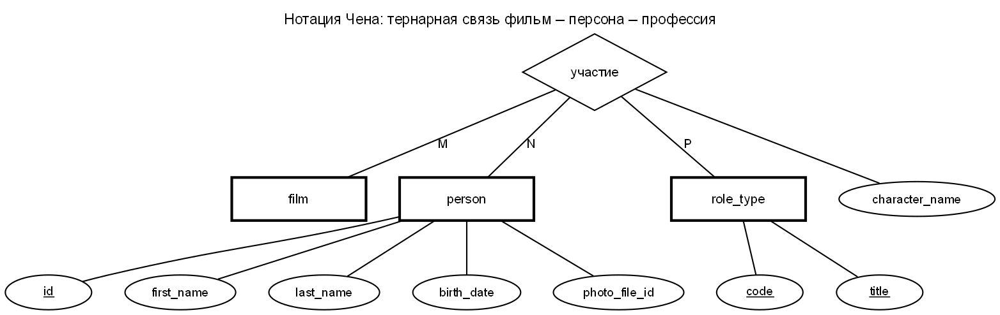
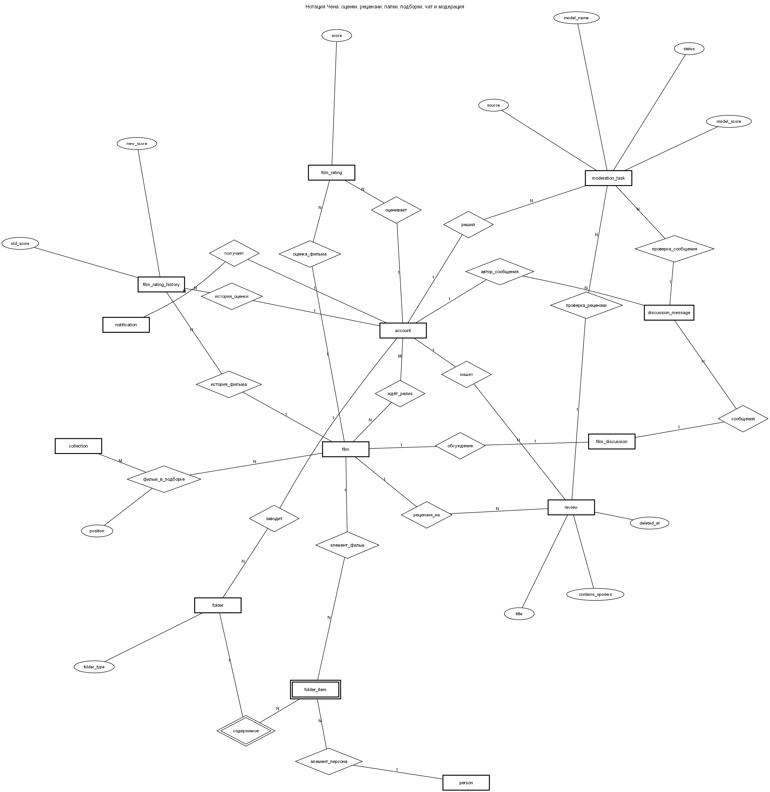
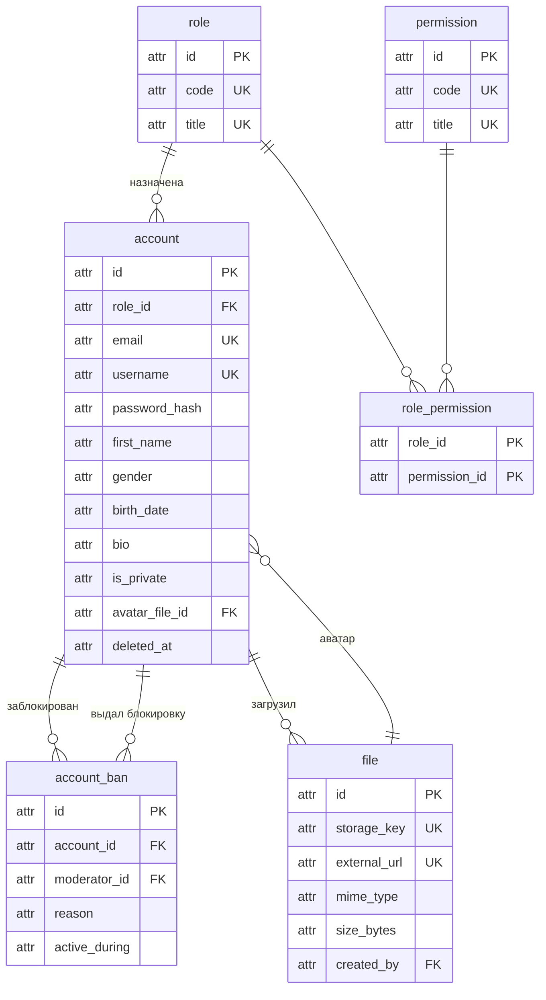
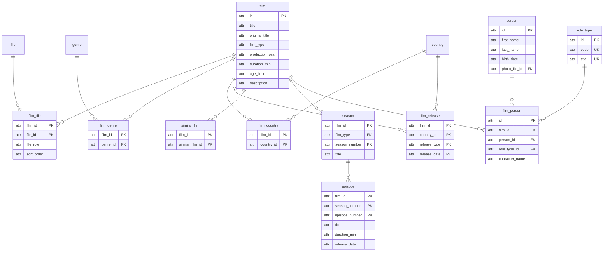
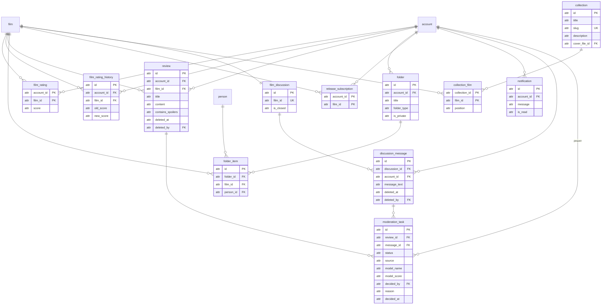
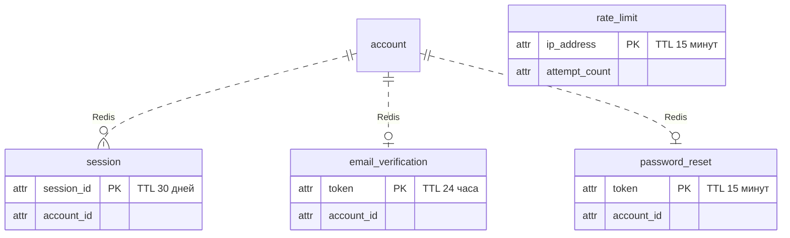

# ER-диаграммы

Основные диаграммы — в **нотации Чена**: сущность рисуется прямоугольником,
связь — ромбом, атрибут — овалом, ключевой атрибут подчёркнут. Двойной контур
означает слабую сущность и идентифицирующую связь: такая сущность не существует
отдельно от родителя и опознаётся только вместе с ним.

Кардинальность подписана на линиях: 1 — одна сторона, M и N — многие, P — третья
сторона тернарной связи.

Файлы лежат в [chen/](chen), в форматах PNG и SVG, исходники — в `.dot`.

---

## 1. Общая карта

Все 31 отношение схемы. Связующие таблицы (`film_genre`, `film_person`,
`collection_film` и другие) в нотации Чена показаны именно как связи-ромбы, а не
как сущности: в реляционной схеме они превращаются в таблицы, но на ER-уровне
это связи.

## 2. Пользователи, права доступа, файлы

Роль пользователя и набор прав вынесены в отдельные сущности: права настраиваются
данными, а не зашиты в код. Блокировка `account_ban` хранит период действия
диапазоном `tstzrange`, на который наложено ограничение EXCLUDE: пересекающихся
блокировок одного пользователя быть не может. Файл — самостоятельная сущность со своими
служебными атрибутами, поэтому у аватара, постера и трейлера общее хранилище.

## 3. Каталог, сезоны и серии

`season` и `episode` — слабые сущности: номер сезона имеет смысл только внутри
сериала, а номер серии — только внутри сезона. Связь «премьера» несёт
собственные атрибуты `release_type` и `release_date`, связь «файлы_фильма» —
атрибуты `file_role` и `sort_order`, за счёт чего у фильма может быть несколько
постеров и трейлеров.

## 4. Фильм, персона, профессия

Связь «участие» тернарная: она соединяет фильм, персону и профессию и несёт
атрибут `character_name`. Поэтому один человек может быть в фильме одновременно
сценаристом и актёром, а один актёр — сыграть несколько персонажей.

## 5. Оценки, рецензии, папки, чат и модерация

`moderation_task` — самостоятельная сущность: проверку проходит и рецензия, и
сообщение чата, решение принимает либо модель, либо модератор.

---

## Приложение: те же связи в виде «вороньей лапки»

Диаграммы ниже показывают ту же схему в виде таблиц со столбцами: так удобнее
сверяться с DDL. Синтаксис Mermaid, рендерится на GitHub. Типы данных не
указаны — они в [fields.md](fields.md).

### Пользователи, права, файлы

### Каталог

### Активность, чат, модерация

### Хранилища вне PostgreSQL

Внешних ключей между разными СУБД нет, связь логическая: целостность
поддерживает приложение.

Кэш топа фильмов (`cache:film_top`, TTL 1 час) в виде таблицы не представим: это
сериализованный список, который перезаписывается целиком.

В S3/MinIO лежат сами файлы, в PostgreSQL — только отношение `file` со ссылками.
Бакеты: `avatar`, `poster`, `still`, `person`, `cover`.
