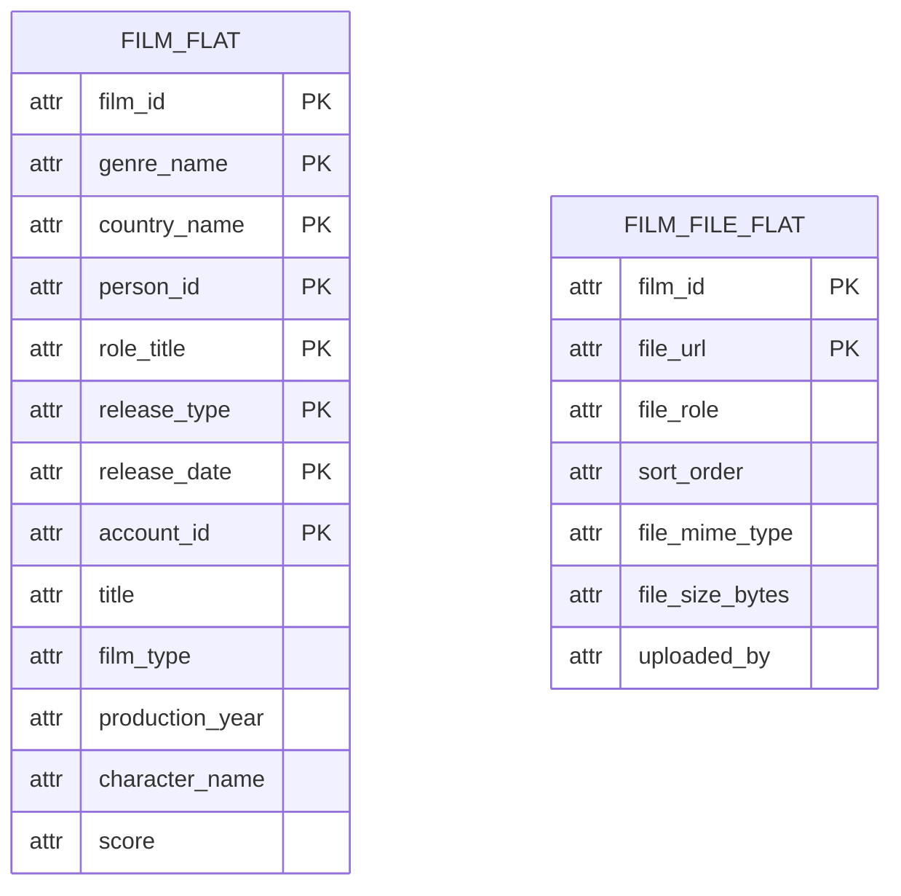
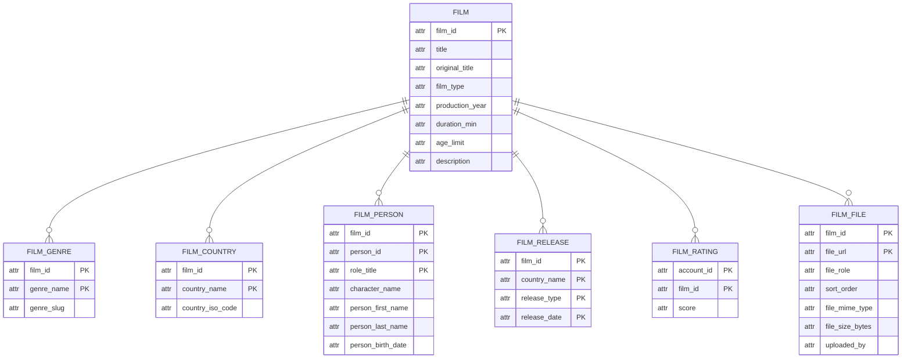
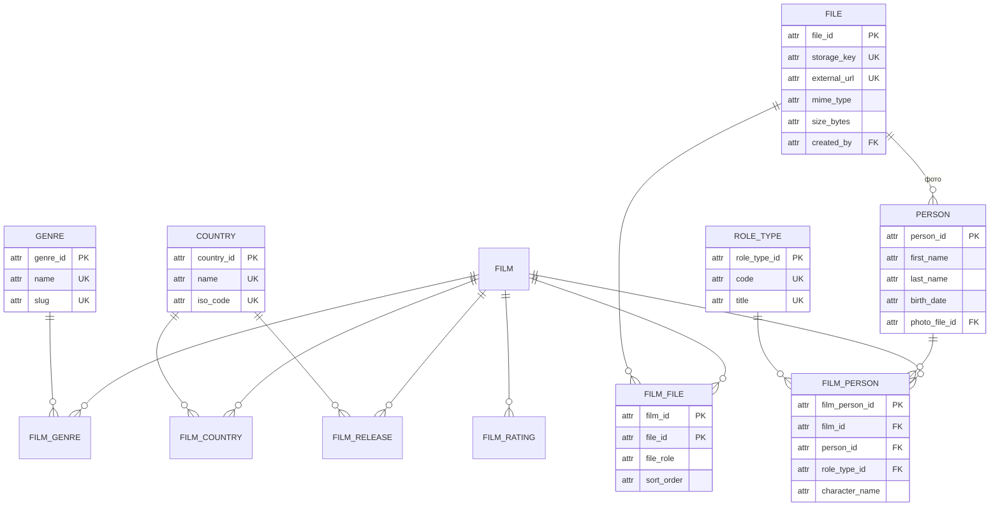

# Приведение схемы к нормальным формам

Документ показывает, как схема «Кинопоиска» пришла от исходного ненормализованного
представления к НФБК. Шаги 1–4 разобраны на каталоге фильмов, шаг 5 проводит тем
же путём остальные области продукта, так что через разбор проходят все 31 отношение. На каждом шаге приводится состав отношений, функциональные
зависимости и то, какая аномалия устранена. DDL здесь нет — он в `../migrations`,
итоговая схема описана в [relations.md](relations.md).

Обозначения: `__атрибут__` — часть первичного ключа, `->` — функциональная
зависимость.

---

## Шаг 0. Ненормализованное представление

Так предметная область выглядит «как есть», если записать карточку фильма одной
строкой, как её видит пользователь на странице.

```
FILM_CARD(__film_id__, title, original_title, film_type, production_year,
          duration_min, age_limit, description,
          posters, trailers,
          genres, countries,
          cast, releases,
          user_ratings, reviews)
```

Пример строки:

| film_id | title | genres | posters | cast | releases | user_ratings |
|---|---|---|---|---|---|---|
| 1 | Побег из Шоушенка | драма, криминал | poster1.jpg, poster2.jpg | Тим Роббинс (Энди), Морган Фриман (Ред), Фрэнк Дарабонт (режиссёр) | США 1994-09-10 премьера; Россия 1995-02-16 прокат | anna 10, ivan 9 |

Что не так:

- `genres`, `countries`, `posters`, `cast`, `releases`, `user_ratings` — множества
  значений в одном поле: их нельзя сравнить, проверить ограничением или связать
  внешним ключом;
- количество постеров и трейлеров заранее неизвестно, а поля `poster_url` и
  `trailer_url` в единственном числе жёстко ограничивают продукт одним файлом
  каждого вида;
- чтобы найти фильмы актёра, пришлось бы искать подстроку в тексте.

Отношение не находится даже в 1НФ.

---

## Шаг 1. Первая нормальная форма

**Правило.** Все атрибуты атомарны, повторяющихся групп нет, у отношения есть
первичный ключ.

Каждое множество разворачивается в отдельные строки. На этом шаге схема ещё
плоская: данные о фильме, жанре, стране, участнике и оценке лежат вместе.

```
FILM_FLAT(__film_id__, __genre_name__, __country_name__, __person_id__,
          __role_title__, __release_type__, __release_date__, __account_id__,
          title, original_title, film_type, production_year, duration_min,
          age_limit, description, genre_slug, country_iso_code,
          person_first_name, person_last_name, person_birth_date,
          character_name, score)

FILM_FILE_FLAT(__film_id__, __file_url__, file_role, sort_order,
               file_mime_type, file_size_bytes, uploaded_by, uploaded_at)
```

Функциональные зависимости:

```
FILM_FLAT:
{film_id, genre_name, country_name, person_id, role_title, release_type,
 release_date, account_id} -> title, original_title, film_type, production_year,
                              duration_min, age_limit, description, genre_slug,
                              country_iso_code, person_first_name,
                              person_last_name, person_birth_date,
                              character_name, score
{film_id} -> title, original_title, film_type, production_year, duration_min,
             age_limit, description
{genre_name} -> genre_slug
{country_name} -> country_iso_code
{person_id} -> person_first_name, person_last_name, person_birth_date
{film_id, person_id, role_title} -> character_name
{film_id, account_id} -> score
```

Что исправлено: значения стали атомарными, постеры и трейлеры превратились в
строки, поэтому их может быть сколько угодно.

Что осталось плохо: название фильма повторяется в каждой строке — столько раз,
сколько у фильма жанров, стран, актёров, премьер и оценок. Отсюда три аномалии:

- **вставки**: нельзя завести фильм, пока у него нет ни одного жанра, страны,
  актёра и оценки — часть ключа осталась бы пустой;
- **обновления**: исправление названия нужно применить ко всем строкам фильма,
  иначе данные разойдутся;
- **удаления**: удалив единственную оценку, можно потерять сведения о фильме.



---

## Шаг 2. Вторая нормальная форма

**Правило.** Отношение в 1НФ, и каждый неключевой атрибут зависит от всего
первичного ключа, а не от его части.

В `FILM_FLAT` частичных зависимостей много: `title` определяется только `film_id`,
`score` — парой `(film_id, account_id)`, `character_name` — тройкой
`(film_id, person_id, role_title)`. Каждая такая зависимость выносится в своё
отношение.

```
FILM(__film_id__, title, original_title, film_type, production_year,
     duration_min, age_limit, description)

FILM_GENRE(__film_id__, __genre_name__, genre_slug)

FILM_COUNTRY(__film_id__, __country_name__, country_iso_code)

FILM_PERSON(__film_id__, __person_id__, __role_title__, character_name,
            person_first_name, person_last_name, person_birth_date)

FILM_RELEASE(__film_id__, __country_name__, __release_type__, __release_date__)

FILM_RATING(__account_id__, __film_id__, score)

FILM_FILE(__film_id__, __file_url__, file_role, sort_order,
          file_mime_type, file_size_bytes, uploaded_by, uploaded_at)
```

Функциональные зависимости:

```
FILM:
{film_id} -> title, original_title, film_type, production_year, duration_min,
             age_limit, description

FILM_GENRE:
{film_id, genre_name} -> genre_slug

FILM_COUNTRY:
{film_id, country_name} -> country_iso_code

FILM_PERSON:
{film_id, person_id, role_title} -> character_name, person_first_name,
                                    person_last_name, person_birth_date

FILM_RELEASE:
{film_id, country_name, release_type, release_date} -> (факт премьеры)

FILM_RATING:
{account_id, film_id} -> score

FILM_FILE:
{film_id, file_url} -> file_role, sort_order, file_mime_type, file_size_bytes,
                       uploaded_by, uploaded_at
```

Что исправлено: название фильма хранится один раз, фильм можно завести без
жанров и оценок, удаление оценки не трогает карточку.

Что осталось плохо: `genre_slug` зависит не от фильма, а от жанра;
`country_iso_code` — от страны; имя и дата рождения персоны повторяются в каждой
её роли. Это транзитивные зависимости.



---

## Шаг 3. Третья нормальная форма

**Правило.** Отношение во 2НФ, и неключевые атрибуты не зависят друг от друга:
транзитивных зависимостей нет.

Каждый словарный атрибут уезжает в собственное отношение, а связь начинает
ссылаться на него ключом.

```
GENRE(__genre_id__, name, slug)
COUNTRY(__country_id__, name, iso_code)
ROLE_TYPE(__role_type_id__, code, title)
PERSON(__person_id__, first_name, last_name, birth_date, photo_file_id)
FILE(__file_id__, storage_key, external_url, mime_type, size_bytes, created_by)

FILM(__film_id__, title, original_title, film_type, production_year,
     duration_min, age_limit, description)
FILM_GENRE(__film_id__, __genre_id__)
FILM_COUNTRY(__film_id__, __country_id__)
FILM_PERSON(__film_person_id__, film_id, person_id, role_type_id, character_name)
FILM_RELEASE(__film_id__, __country_id__, __release_type__, __release_date__)
FILM_FILE(__film_id__, __file_id__, file_role, sort_order)
FILM_RATING(__account_id__, __film_id__, score)
```

Функциональные зависимости:

```
GENRE:
{genre_id} -> name, slug
{name} -> genre_id, slug
{slug} -> genre_id, name

COUNTRY:
{country_id} -> name, iso_code
{iso_code} -> country_id, name

ROLE_TYPE:
{role_type_id} -> code, title
{code} -> role_type_id, title

PERSON:
{person_id} -> first_name, last_name, birth_date, photo_file_id

FILE:
{file_id} -> storage_key, external_url, mime_type, size_bytes, created_by
{storage_key} -> file_id, external_url, mime_type, size_bytes, created_by

FILM_GENRE:
{film_id, genre_id} -> (факт связи)

FILM_PERSON:
{film_person_id} -> film_id, person_id, role_type_id, character_name
{film_id, person_id, role_type_id, character_name} -> film_person_id

FILM_FILE:
{film_id, file_id} -> file_role, sort_order
{film_id, file_role, sort_order} -> file_id
```

Что исправлено:

| Было | Стало | Аномалия, которую убрали |
|---|---|---|
| `genre_slug` рядом с фильмом | отношение `GENRE` | переименование жанра требовало правки всех фильмов этого жанра |
| `country_iso_code` рядом с фильмом | отношение `COUNTRY` | то же для стран |
| имя персоны в каждой её роли | отношение `PERSON` | смена фамилии актёра меняла бы десятки строк |
| `role_title` текстом | отношение `ROLE_TYPE` | опечатка «режисёр» создавала новую профессию |
| свойства файла у связи с фильмом | отношение `FILE` | тип, размер и автор загрузки дублировались при повторном использовании файла |



---

## Шаг 4. Нормальная форма Бойса-Кодда

**Правило.** В левой части каждой функциональной зависимости стоит потенциальный
ключ отношения.

После третьего шага схема уже почти в НФБК. Проверяются отношения, где
потенциальных ключей несколько.

| Отношение | Детерминанты | Все ли они ключи |
|---|---|---|
| `GENRE` | `{genre_id}`, `{name}`, `{slug}` | да, каждый объявлен уникальным |
| `COUNTRY` | `{country_id}`, `{name}`, `{iso_code}` | да |
| `FILM_PERSON` | `{film_person_id}`, `{film_id, person_id, role_type_id, character_name}` | да |
| `FILM_FILE` | `{film_id, file_id}`, `{film_id, file_role, sort_order}` | да |
| `FILM_RELEASE` | `{film_id, country_id, release_type, release_date}` | отношение всеключевое |
| `FOLDER` | `{folder_id}`, `{account_id, title}` | да |

Отдельные решения этого шага:

- **`FILM_RELEASE`**: дата включена в первичный ключ. Без неё повторный прокат
  того же фильма в той же стране был бы невозможен, а с ней отношение становится
  всеключевым, и вопрос о частичных зависимостях снимается сам.
- **`SEASON` и `EPISODE`**: номер сезона имеет смысл только внутри сериала, номер
  серии — только внутри сезона, поэтому ключи составные:
  `{film_id, season_number}` и `{film_id, season_number, episode_number}`.
- **`SIMILAR_FILM`**: пара хранится один раз в возрастающем порядке
  идентификаторов, иначе одна и та же связь существовала бы дважды.

---

## Шаг 5. Остальные области продукта

Шаги 1–4 разобраны на каталоге фильмов: это самая наглядная часть схемы.
Остальные области проходят тот же путь, и ниже он показан для каждой из них:
исходное представление, нарушение нормальной формы, итоговые отношения.

### 5.1. Профиль и права доступа

Ненормализованно профиль выглядит так: у пользователя текстовая роль и список
прав, перечисленный в одном поле.

```
ACCOUNT_FLAT(__account_id__, email, username, password_hash, first_name,
             role_title, permissions)
```

| Нарушение | Разбор |
|---|---|
| 1НФ | `permissions` — множество значений в одном поле |
| 3НФ | `role_title` — текст, а набор прав зависит от роли, а не от пользователя: это транзитивная зависимость через роль |

Итог:

```
ROLE(__role_id__, code, title)
PERMISSION(__permission_id__, code, title)
ROLE_PERMISSION(__role_id__, __permission_id__)
ACCOUNT(__account_id__, role_id, email, username, password_hash, first_name,
        gender, birth_date, bio, is_private, avatar_file_id, deleted_at)
```

```
ROLE:
{role_id} -> code, title
{code} -> role_id, title

PERMISSION:
{permission_id} -> code, title
{code} -> permission_id, title

ROLE_PERMISSION:
{role_id, permission_id} -> (факт выдачи права)

ACCOUNT:
{account_id} -> role_id, email, username, password_hash, first_name, gender,
                birth_date, bio, is_private, avatar_file_id, deleted_at
{email} -> account_id, role_id, username, password_hash, first_name, gender,
           birth_date, bio, is_private, avatar_file_id, deleted_at
{username} -> account_id, role_id, email, password_hash, first_name, gender,
              birth_date, bio, is_private, avatar_file_id, deleted_at
```

### 5.2. Сезоны и серии

Ненормализованно сериал хранит сезоны и серии прямо в карточке.

```
SERIES_FLAT(__film_id__, title, seasons, episodes)
```

| Нарушение | Разбор |
|---|---|
| 1НФ | `seasons` и `episodes` — списки; вариант с полями `season_1`, `season_2` — повторяющаяся группа |
| 2НФ | название серии зависит от тройки «фильм + сезон + номер серии», а не от фильма |

Итог — слабые сущности с составными ключами:

```
SEASON(__film_id__, __season_number__, film_type, title)
EPISODE(__film_id__, __season_number__, __episode_number__, title,
        duration_min, release_date)
```

```
SEASON:
{film_id, season_number} -> film_type, title

EPISODE:
{film_id, season_number, episode_number} -> title, duration_min, release_date
```

`film_type` в `SEASON` — константа `'series'`, существующая ради составного
внешнего ключа на `FILM(film_id, film_type)`: так СУБД сама запрещает заводить
сезон у фильма.

### 5.3. Оценки, история оценок и рецензии

Ненормализованно оценка и рецензия лежат в одной строке вместе с признаками
модерации.

```
REVIEW_FLAT(__account_id__, __film_id__, score, title, content,
            contains_spoilers, is_approved, moderator_name, moderated_at,
            is_deleted, score_history)
```

| Нарушение | Разбор |
|---|---|
| 1НФ | `score_history` — история изменений оценки в одном поле |
| 2НФ | рецензия и оценка — разные факты: оценку ставят без рецензии |
| 3НФ | `moderator_name` зависит от решения модерации, а не от пары «пользователь + фильм» |

Итог:

```
FILM_RATING(__account_id__, __film_id__, score)
FILM_RATING_HISTORY(__history_id__, account_id, film_id, old_score, new_score,
                    created_at)
REVIEW(__review_id__, account_id, film_id, title, content, contains_spoilers,
       deleted_at, deleted_by)
```

```
FILM_RATING:
{account_id, film_id} -> score

FILM_RATING_HISTORY:
{history_id} -> account_id, film_id, old_score, new_score, created_at

REVIEW:
{review_id} -> account_id, film_id, title, content, contains_spoilers,
               deleted_at, deleted_by
{account_id, film_id} -> review_id, title, content, contains_spoilers,
                         deleted_at, deleted_by
```

`FILM_RATING_HISTORY` — журнал только на запись: он и обеспечивает требование
историчности данных.

### 5.4. Папки, подписки и подборки

Ненормализованно списки пользователя хранятся полями прямо в профиле.

```
LIBRARY_FLAT(__account_id__, favorites, watch_later, watched, favorite_persons,
             release_subscriptions)
COLLECTION_FLAT(__collection_id__, title, films)
```

| Нарушение | Разбор |
|---|---|
| 1НФ | каждое поле — список идентификаторов |
| 2НФ | позиция фильма в подборке зависит от пары «подборка + фильм» |
| 3НФ | название фильма в подборке дублировало бы `FILM` |

Итог:

```
FOLDER(__folder_id__, account_id, title, folder_type, is_private)
FOLDER_ITEM(__item_id__, folder_id, film_id, person_id)
RELEASE_SUBSCRIPTION(__account_id__, __film_id__)
COLLECTION(__collection_id__, title, slug, description, cover_file_id)
COLLECTION_FILM(__collection_id__, __film_id__, position)
```

```
FOLDER:
{folder_id} -> account_id, title, folder_type, is_private
{account_id, title} -> folder_id, folder_type, is_private

FOLDER_ITEM:
{item_id} -> folder_id, film_id, person_id
{folder_id, film_id} -> item_id, person_id
{folder_id, person_id} -> item_id, film_id

RELEASE_SUBSCRIPTION:
{account_id, film_id} -> (факт подписки)

COLLECTION:
{collection_id} -> title, slug, description, cover_file_id
{slug} -> collection_id, title, description, cover_file_id

COLLECTION_FILM:
{collection_id, film_id} -> position
{collection_id, position} -> film_id
```

Элемент папки — либо фильм, либо персона: одно поле `item_id` со ссылкой
«на что угодно» не позволило бы объявить внешний ключ, поэтому ссылки две, а
выбор между ними закреплён ограничением.

### 5.5. Уведомления и чат обсуждения

Ненормализованно переписка и уведомления лежат списками у пользователя и у
фильма.

```
NOTIFICATION_FLAT(__account_id__, messages)
DISCUSSION_FLAT(__film_id__, messages, authors)
```

| Нарушение | Разбор |
|---|---|
| 1НФ | `messages` и `authors` — списки, причём параллельные: их позиции связаны неявно |
| 2НФ | текст сообщения зависит от самого сообщения, а не от фильма |

Итог:

```
NOTIFICATION(__notification_id__, account_id, message, is_read)
FILM_DISCUSSION(__discussion_id__, film_id, is_closed)
DISCUSSION_MESSAGE(__message_id__, discussion_id, account_id, message_text,
                   deleted_at, deleted_by)
```

```
NOTIFICATION:
{notification_id} -> account_id, message, is_read

FILM_DISCUSSION:
{discussion_id} -> film_id, is_closed
{film_id} -> discussion_id, is_closed

DISCUSSION_MESSAGE:
{message_id} -> discussion_id, account_id, message_text, deleted_at, deleted_by
```

### 5.6. Модерация

Ненормализованно состояние проверки хранилось флагами прямо в рецензии и
сообщении: `is_approved`, `is_deleted`, `deleted_by_admin`.

| Нарушение | Разбор |
|---|---|
| 3НФ | имя модератора и основание решения зависят от решения, а не от рецензии |
| Дублирование | одинаковые флаги пришлось бы повторять в рецензии, сообщении и любом будущем виде контента |

Итог — одно отношение на все виды проверок и отдельное отношение для блокировок:

```
MODERATION_TASK(__task_id__, review_id, message_id, status, source, model_name,
                model_score, decided_by, reason, decided_at)
ACCOUNT_BAN(__ban_id__, account_id, moderator_id, reason, active_during)
```

```
MODERATION_TASK:
{task_id} -> review_id, message_id, status, source, model_name, model_score,
             decided_by, reason, decided_at

ACCOUNT_BAN:
{ban_id} -> account_id, moderator_id, reason, active_during
{account_id, active_during} -> ban_id, moderator_id, reason
```

Вторая зависимость в `ACCOUNT_BAN` держится ограничением на пересечение
периодов: у одного пользователя блокировки не накладываются друг на друга,
поэтому пара «пользователь + период» уникальна.

### 5.7. Где какое отношение появилось

| Отношение | Шаг, на котором появилось |
|---|---|
| `film` | 2 |
| `film_genre`, `genre` | 2, справочник выделен на шаге 3 |
| `film_country`, `country` | 2, справочник выделен на шаге 3 |
| `film_person`, `person`, `role_type` | 2, справочники выделены на шаге 3 |
| `film_release` | 2, ключ дополнен датой на шаге 4 |
| `film_rating` | 2 |
| `film_file`, `file` | 2, свойства файла выделены на шаге 3 |
| `similar_film` | 4 |
| `season`, `episode` | 5.2 |
| `role`, `permission`, `role_permission`, `account` | 5.1 |
| `film_rating_history`, `review` | 5.3 |
| `folder`, `folder_item`, `release_subscription` | 5.4 |
| `collection`, `collection_film` | 5.4 |
| `notification`, `film_discussion`, `discussion_message` | 5.5 |
| `moderation_task`, `account_ban` | 5.6 |

Всего 31 отношение. Каждое из них описано в [relations.md](relations.md).

---

## Что ещё изменилось вместе с нормализацией

Эти решения не следуют из нормальных форм напрямую, но появились при
проектировании рядом с ними.

| Решение | Причина |
|---|---|
| `production_year` вместо `release_year` | год производства не выводится из дат премьер: фильм могут снять в одном году, выпустить в другом, а могут не выпустить вовсе. Дублирования нет |
| у сериала нет `duration_min` | «средняя длительность серии» — производное значение, оно считается запросом по `EPISODE` |
| мягкое удаление учётной записи | при каскадном удалении исчезали рецензии, оценки и история; теперь персональные данные стираются, а пользовательский контент остаётся |
| `moderation_task` вместо флага `is_approved` | состояние проверки не дублируется в двух местах и одинаково описывает решение модератора и модели |
| `deleted_at` и `deleted_by` вместо `is_deleted` | видно не только то, что объект удалён, но и кем: автором или модератором |

---

## Итог

| Шаг | Отношений | Главная проблема, решённая на шаге |
|---|---|---|
| 0. Ненормализованное | 1 | множества значений в одном поле |
| 1. Первая нормальная форма | 2 | атомарность атрибутов |
| 2. Вторая нормальная форма | 7 | частичные зависимости от части ключа |
| 3. Третья нормальная форма | 12 | транзитивные зависимости, справочники |
| 4. НФБК | 13 | детерминанты приведены к потенциальным ключам |
| 5. Остальные области продукта | 31 | профиль и права, сезоны и серии, оценки и рецензии, папки и подборки, чат, модерация |

Итоговый состав всех 31 отношения с описаниями и полным списком функциональных
зависимостей — в [relations.md](relations.md), типы и ограничения — в
[fields.md](fields.md), ER-диаграммы — в [er.md](er.md).
